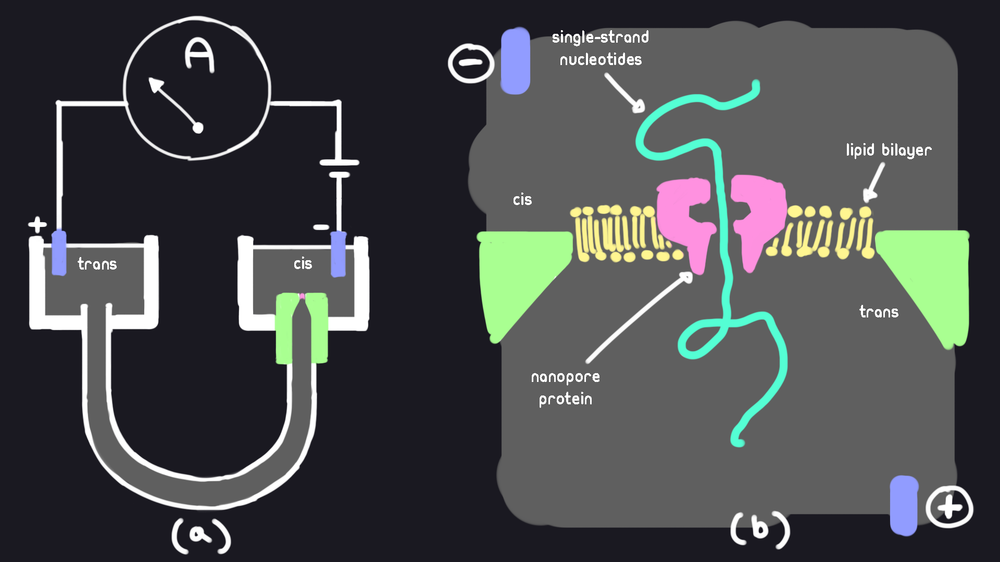
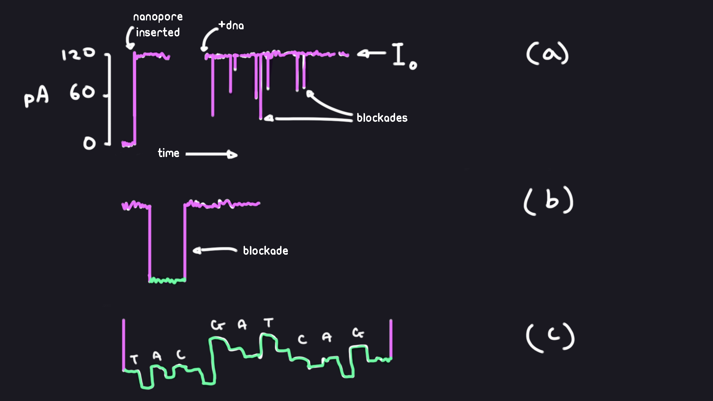

# Nanopore signal data, the SLOW5 format, and you

In this document we provide a brief overview and explanation of nanopore signal data in relation to the SLOW5 file format. We explain what nanopore sequencing is, how we observe and interpret the data, and how SLOW5 fits into all of it.

## What the Heck is a Nanopore?

Nanopore sequencing is a method of capturing the nucleobase sequence of single-stranded DNA (ssDNA) or RNA. 
This specific method involves driving single strand nucleic acids through a nanoscopic protein pore by an applied voltage.
This protein pore is sensitive to the nucleobases being fed through it, and will change in conductivity depending on the nucleobase sequence inside the pore.
By measuring the conductivity of the pore, we store this signal data, and later map it to the base sequence of our ssDNA and RNA.

### The Setup

This figure shows the setup of a nanopore experiment. A DNA strand is drawn through the nanopore by applying voltage. An ion-containing fluid is channeled through a nanopore in the lipid bilayer. The lipid bilayer separates two chambers filled with buffered potassium chloride solutions (KCl). The chambers are named *cis* and *trans* respectively.



(a) The chambers *cis* and *trans* are interconnected via a U-shaped tube. Both chambers are filled with KCl. A voltage bias is applied via the electrodes in each chamber. This bias pulls ions and molecules from the *cis* side to the *trans* side. An ammeter measures the ionic current flowing from the *cis* chamber to the *trans* chamber.

(b) Magnification of the *cis* chamber. The pore in the *cis* side provides the only connection between the two chambers. This is the only point where ions and molecules can move from the *cis* side to the *trans* side.

α-hemolysin is a nanopore protein commonly used in initial experiments. The reason it is so suitable for nanopore sequencing is because it forms a ~1.5nm opening through the impermeable lipid-bilayer. This diameter, whilst much larger than the ions of the KCl solution, allowing for easy passage; can only just fit a single polynucleotide of DNA (~1.2nm), and cannot fit double-stranded DNA (~2.4nm).

In order to accurately map the current to the passage of nucleic acids through the nanopore, we must be able to control the rate at which the strand is being passed through. To solve this, a motor protein (that is unable to fit through the pore), is attached to the end of a ssDNA/RNA strand. Enzymes such as helicases and polymerases have the advantage of traversing though DNA in distinct steps, without needing any additional external source of energy applied. Now when a strand is pulled through the nanopore, it can only go through as fast as the motor protein allows it.

### The Data

Tranditionally, a voltage bias of ~120-180mV is applied between the two sides of the KCl solution. Without the nanopore protein, no ionic current can be measured through the lipid bilayer. Once the protein inserts itself into the bilayer, ions will start flowing through and we see an increase in the measured ionic current. This baseline current it increases to is called the "open channel current". When ssDNA or RNA is added to the *cis* chamber, we begin to see sudden drops in the measured current. We call these transient reductions "blockades". Small modulations in current are sometimes found in these blockades.



(a) Example measured current over time. We see an increase in current once the nanopore is inserted and an ion flow created. The open pore current I<sub>o</sub> is our baseline current. Most blockades that occur are observed to be the result of polynucleoptide strands being pulled through the pore.

(b) View of a single blockade magnified.

(c) Small modulations in current we might see in a blockade. These modulations are interpreted as corresponding to specific DNA or RNA bases.

## Current Limitations

The nanopore proteins used today have a sensing zone of a minimum 4-5 nucleobases. What this means is that we cannot create a 1-1 mapping of the signal to individual nucleobases. Until a nanopore protein is found that can produce a current reflecting a single nucleobase, we rely on computational algorithms and techniques to decode nanopore signal data.

## Why SLOW5?

Oxford Nanopore Technologies (ONT) is the leading commercial provider of nanopore sequencing. The default FAST5 file format is not optimal for the large amounts of data processing and manipulation required for interpreting nanopore signal data. Hence, SLOW5 was developed to overcome inherent limitations in the standard FAST5 signal data format that prevent efficient, scalable analysis and cause many headaches for developers.

## Whats inside my SLOW5 file?

SLOW5 stores the metadata and raw signal output of DNA/RNA sequencing runs completed through ONT nanopore platforms such as the PromethION, and MinION. Metadata can be viewed in the header of each SLOW5. Distinct partitions of signal data captured by the sequencing run is stored in separate records or "reads" in the body of the SLOW5 file.

Here we will use [slow5tools](https://github.com/hasindu2008/slow5tools), and files from a [small slow5 file](../assets/data/reads.slow5) for example usage.

The full specifications of each SLOW5 version can be found here: [slow5 specs](https://hasindu2008.github.io/slow5specs/).

### Header

The header of a slow5 file will contain all the meta data associated with reads in your file. It is located at the start of the file.

```sh
# view the header of a slow5 file
slow5tools skim --hdr reads.slow5
```

Here are some fields in our example file:

```sh
@device_type promethion             # ONT platform the data was sequenced on
@hostname C48B226                   # name of the device that hosted the run
@sequencing_kit sqk-lsk114          # kit used by the ONT nanopore sequencer
@distribution_version 22.12.5       # the version of MinKNOW used for the run
@sample_id A12878                   # name of the sample given by the user
@experiment_duration_set 320        # how long the run went for (minutes)
@sample_frequency 4000              # no. of data points collected per second
@exp_script_purpose sequencing_run  # indicates the purpose of the experiment
@experiment_type genomic_dna        # indicates the type of experiment performed
```

There are many more fields, and most of them are for advanced users that require a more detailed explanation. The full specification can be found here: [slow5 specs](https://hasindu2008.github.io/slow5specs/).

### Records (Reads)

Each strand of ssDNA/RNA that gets sequenced through a nanopore has its resulting signal data stored into a slow5 record or "read". Each read is identified by a "read id"

```sh
# get all the read ids contained ina slow5 file
slow5tools skim -rid reads.slow5

# read ids contained in our example
00002194-fea5-433c-ba89-1eb6b60f0f28
00013808-f7cb-4c36-8cdd-265aba0a7487
0001960d-c143-4faf-bf20-753b9041812a
0001c9f9-29f8-4e72-b2f8-d291273baea6
00027dc0-458e-4153-ba46-2fb030aa34b8
000286ab-1f80-40e3-a778-8d89e4e52940
0003c949-8c33-4287-babd-eee408525dea
0003d6d3-45c5-4ffd-96ee-ebc3a8ed7698
00040c8f-ca80-4282-8de9-be5aa25fce1d
00049d1a-a957-472b-a1a1-86e4dac6c568
```

Reads also contain additional metadata useful for data analysis. 

```sh
# view all the fields of each read in a slow5 file
slow5tools skim reads.slow5 
```

Here are some fields from the first read of our example:

```sh
read_id 00002194-fea5-433c-ba89-1eb6b60f0f28
read_group 0          # read group that the read belongs to, explained later
digitisation 2048     # number of quantization levels in the ADC converter
sampling_rate 4000    # no. of data points collected per second
len_raw_signal 244508 # number of samples in this read
raw_signal .          # not displayed
```

Most of the other fields are for advanced users and require a more detailed explanation. The full specification can be found here: [slow5 specs](https://hasindu2008.github.io/slow5specs/).

### Read Groups

Multiple different runs can be stored in a single slow5 file. Doing so will organize the data into different "read groups". Metadata associated with each read group is stored in the header in their respective fields. Each read in a slow5 file contains the field `read_group`, indicating the read group it belongs to. Read groups are identified by their order in the header.

## Small Example Uses

Here we will use [slow5tools](https://github.com/hasindu2008/slow5tools), and files from [this directory](../assets/data) for example usage. 

```sh
# print the stats of a slow5 file
slow5tools stats reads.slow5

# convert fast5 files to slow5 files
mkdir blow5_dir && slow5tools f2s fast5_dir -d blow5_dir
# merge all the slow5 files in to a single file
slow5tools merge blow5_dir -o reads.blow5

# convert slow5 to blow5
slow5tools view reads.slow5 -o reads.blow5

# extract 5 random reads from a blow5
slow5tools skim --rid reads.blow5 | sort -R | head -5 > rand_5_rid.txt
slow5tools get reads.blow5 --list rand_5_rid.txt -o reads_subsubsample.blow5

# fetch a single read from a slow5 file
slow5tools get reads.blow5 00002194-fea5-433c-ba89-1eb6b60f0f28
```

More advanced uses can be found in the full documation: [slow5tools docs](https://hasindu2008.github.io/slow5tools/).